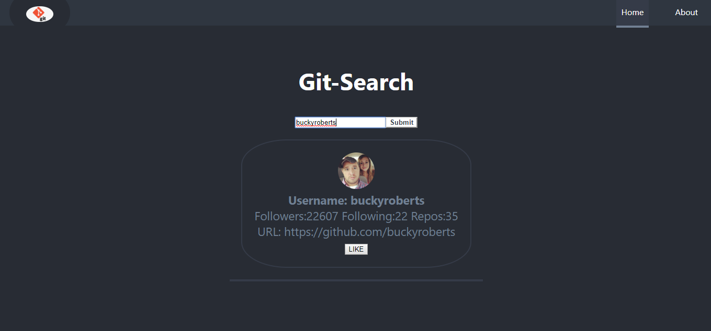

## React + Github API

__In this project you can serach any github username their number of followers and following and how much repos they have will appear.
The searched user is stored in local state, click the like button to add user to redux store similarly, search and add more users creating a list of users.__



### Getting Started

First, clone the repo

```
$ git remote add origin https://github.com/sufyansalim/react-redux-github-api.git
```

Next, load all the dependencies  

```
$ cd react-github-api
$ npm install
``` 
Finally, run the node server with

```
$ npm start
```
 
